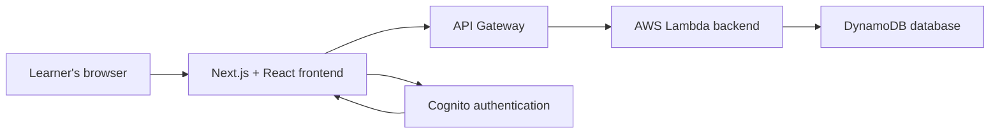
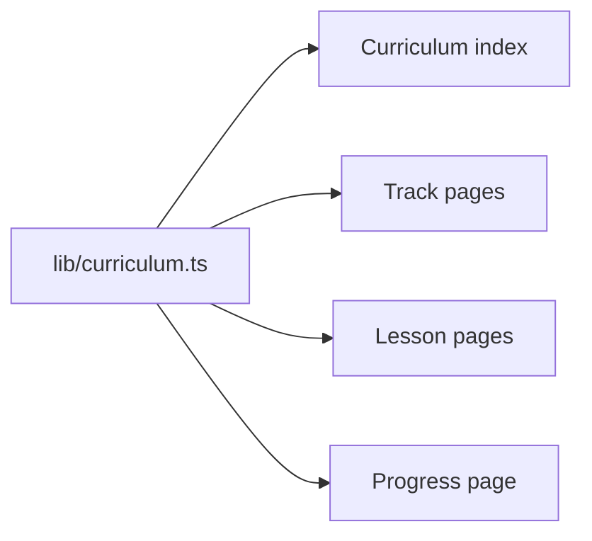
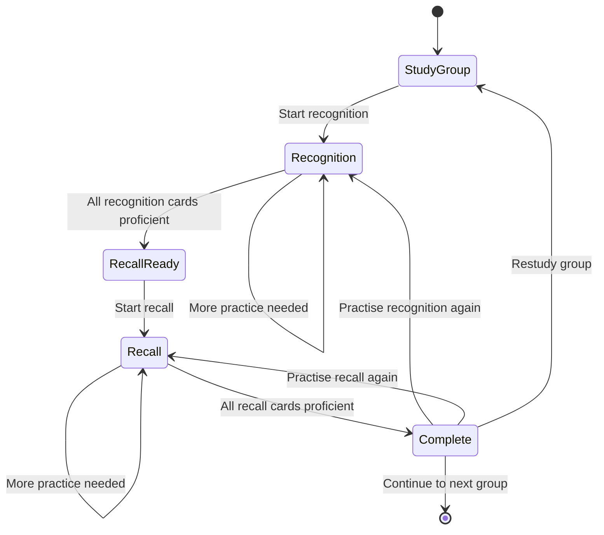
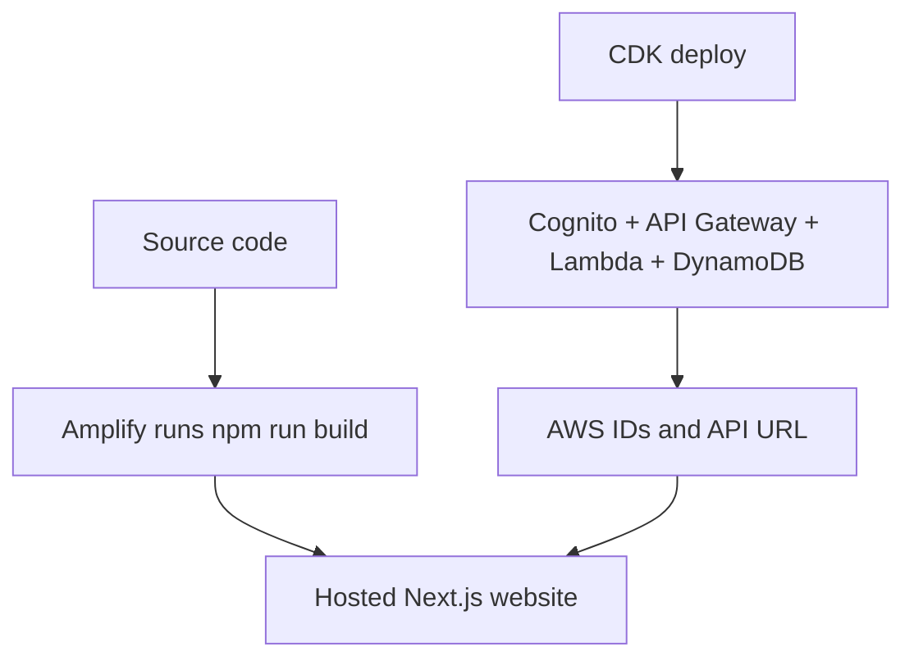

# Full-stack Workflow Tutorial — Koto Japanese Learning App

> [!summary]
> This tutorial explains how the Koto website fits together from a beginner's point of view. It follows the order in which someone could build the application and connects each stage to the files in the current project.

## 1. What does “full stack” mean?

A website like Koto has several layers:

1. **The frontend** is what the learner sees and interacts with.
2. **The backend** receives trusted requests and applies important rules.
3. **The database** stores accounts, progress, cards, and review history.
4. **Infrastructure** creates and connects the cloud services.
5. **Deployment** puts the frontend and backend on the internet.

These layers form the application's **stack**. Working on all of them is called **full-stack development**.



The frontend should not directly edit the database. Instead, it asks the backend to perform an operation. The backend checks the request, applies the rules, and then writes to the database.

For example:

```text
Learner types "a" for あ
        ↓
React checks the answer for immediate feedback
        ↓
The frontend sends the answer to the AWS API
        ↓
Lambda independently checks the answer again
        ↓
Lambda runs FSRS and calculates the next review date
        ↓
DynamoDB stores the updated card and review log
        ↓
The response is returned to the browser
```

The repeated backend check is important. A user can alter frontend JavaScript in their own browser, but they cannot be allowed to bypass the trusted server rules.

---

## 2. The technologies in this project

| Layer | Technology | What it does |
|---|---|---|
| Language | TypeScript | Adds types and error checking to JavaScript |
| Web framework | Next.js 15 App Router | Creates pages, routes, builds, and metadata |
| Interface library | React 19 | Builds interactive components and manages UI state |
| Styling | CSS with Tailwind/PostCSS processing | Controls layout, colours, spacing, and responsive design |
| Authentication client | AWS Amplify | Connects the browser to Cognito |
| Authentication service | Amazon Cognito | Handles accounts, email verification, login, and password recovery |
| API entry point | Amazon API Gateway | Exposes protected URLs for the frontend to call |
| Backend code | AWS Lambda with Node.js | Grades answers and applies application rules |
| Database | Amazon DynamoDB | Stores progress, cards, and review logs |
| Infrastructure | AWS CDK | Describes AWS resources in TypeScript |
| Hosting | AWS Amplify Hosting configuration | Builds and hosts the Next.js frontend |
| Spaced repetition | `ts-fsrs` | Calculates the next test date for a card |
| TTS | Browser Speech Synthesis API | Plays synthesized Japanese audio |
| Testing | Vitest + React Testing Library + jsdom | Tests logic and interface behaviour |
| Package manager | npm | Downloads libraries and runs project commands |

> [!note]
> Flask, Supabase, Vercel, native-speaker recordings, and a paid speech-recognition API are not part of the current implementation.

---

## 3. Before writing code: decide what must exist

Before creating files, list the product's main pages and data.

### Pages

- Landing page
- Curriculum index
- Track page
- Lesson page
- Kana learning path
- Scheduled kana test
- Progress page
- Login and registration
- Account settings
- About page

### Data

- Curriculum tracks and lesson content
- Kana and accepted rōmaji spellings
- Lesson completion
- Kana learning proficiency
- FSRS scheduling state
- Review history
- User identity

This step matters because pages and data lead to different kinds of files:

- A URL normally needs a file under `app/`.
- A reusable interface needs a file under `components/`.
- Shared data or logic belongs under `lib/`.
- AWS resources and backend handlers belong under `infra/`.

```text
japanese-foundations-bootstrap/
├── app/          Next.js pages and global application setup
├── components/   React interfaces used by pages
├── lib/          Content and reusable learning logic
├── infra/        AWS infrastructure and backend code
├── public/       Static files served to visitors
└── tests/config  Testing, TypeScript, build, and deployment configuration
```

---

## 4. Step one: create the Next.js foundation

The project begins as a **Next.js App Router** application using TypeScript.

Next.js uses folders to create URLs. A file called `page.tsx` represents the page at that folder's URL.

| File | URL |
|---|---|
| [`app/page.tsx`](japanese-foundations-bootstrap/app/page.tsx) | `/` |
| [`app/learn/page.tsx`](japanese-foundations-bootstrap/app/learn/page.tsx) | `/learn` |
| [`app/kana/page.tsx`](japanese-foundations-bootstrap/app/kana/page.tsx) | `/kana` |
| [`app/practice/page.tsx`](japanese-foundations-bootstrap/app/practice/page.tsx) | `/practice` |
| [`app/dashboard/page.tsx`](japanese-foundations-bootstrap/app/dashboard/page.tsx) | `/dashboard` |
| [`app/login/page.tsx`](japanese-foundations-bootstrap/app/login/page.tsx) | `/login` |

### The root layout

[`app/layout.tsx`](japanese-foundations-bootstrap/app/layout.tsx) is the shared frame around every page.

It adds:

- The `<html>` and `<body>` elements.
- Site metadata used by browsers and link previews.
- The React progress provider.
- The site header.
- The guest warning.
- The footer.

Conceptually, it does this:

```tsx
<Providers>
  <SiteHeader />
  <GuestBanner />
  {children}
  <SiteFooter />
</Providers>
```

`children` means “place the current page here.” When the learner visits `/kana`, Next.js inserts the kana page in that location.

### Global styling

[`app/globals.css`](japanese-foundations-bootstrap/app/globals.css) contains the visual system for the site:

- Colour variables such as `--paper`, `--ink`, and `--coral`.
- Typography.
- Buttons and links.
- Navigation.
- Lesson layouts.
- Kana-learning layouts.
- Test layouts.
- Progress-page layouts.
- Mobile breakpoints.
- Reduced-motion accessibility rules.

Tailwind is installed and passed through PostCSS, but the present interface is mostly written as ordinary CSS classes rather than Tailwind utility classes.

### Configuration created at this stage

- [`package.json`](japanese-foundations-bootstrap/package.json) lists dependencies and commands.
- [`tsconfig.json`](japanese-foundations-bootstrap/tsconfig.json) enables strict TypeScript checking.
- [`next.config.ts`](japanese-foundations-bootstrap/next.config.ts) is the Next.js configuration file.
- [`postcss.config.mjs`](japanese-foundations-bootstrap/postcss.config.mjs) enables Tailwind's PostCSS processing.
- [`eslint.config.mjs`](japanese-foundations-bootstrap/eslint.config.mjs) defines code-quality checks.
- [`package-lock.json`](japanese-foundations-bootstrap/package-lock.json) records the exact installed dependency versions.

---

## 5. Step two: split pages from components

A route file should usually stay small. Its job is to connect a URL to a larger React component.

For example, [`app/practice/page.tsx`](japanese-foundations-bootstrap/app/practice/page.tsx) effectively says:

```tsx
import { PracticeView } from "@/components/practice-view";

export default function PracticePage() {
  return <PracticeView />;
}
```

This separation has two benefits:

1. The Next.js routing code remains easy to understand.
2. The interactive React component can grow without making the route confusing.

### Shared layout components

- [`components/site-header.tsx`](japanese-foundations-bootstrap/components/site-header.tsx) contains the navigation and mobile menu.
- [`components/site-footer.tsx`](japanese-foundations-bootstrap/components/site-footer.tsx) contains footer links and the audio note.
- [`components/guest-banner.tsx`](japanese-foundations-bootstrap/components/guest-banner.tsx) warns visitors that guest progress is temporary.

### Page-sized React components

- [`components/track-view.tsx`](japanese-foundations-bootstrap/components/track-view.tsx) renders a curriculum track and its lessons.
- [`components/lesson-view.tsx`](japanese-foundations-bootstrap/components/lesson-view.tsx) renders lesson content and lesson checks.
- [`components/kana-learning-view.tsx`](japanese-foundations-bootstrap/components/kana-learning-view.tsx) runs self-paced kana learning.
- [`components/practice-view.tsx`](japanese-foundations-bootstrap/components/practice-view.tsx) runs scheduled FSRS testing.
- [`components/dashboard-view.tsx`](japanese-foundations-bootstrap/components/dashboard-view.tsx) renders the simplified progress summary.
- [`components/auth-view.tsx`](japanese-foundations-bootstrap/components/auth-view.tsx) handles the authentication screens.

### Small reusable components

- [`components/tts-button.tsx`](japanese-foundations-bootstrap/components/tts-button.tsx) plays Japanese TTS.
- [`components/pitch-contour.tsx`](japanese-foundations-bootstrap/components/pitch-contour.tsx) draws pitch-accent diagrams.

> [!tip]
> A useful rule is: **pages choose what screen to show; components define how that screen behaves.**

---

## 6. Step three: create the curriculum and kana data

The application needs content before it can render meaningful lessons.

### Curriculum content

[`lib/curriculum.ts`](japanese-foundations-bootstrap/lib/curriculum.ts) acts as the curriculum's current content store.

It defines TypeScript shapes such as:

- `Track`
- `Lesson`
- `LessonSection`
- `QuizQuestion`

It then exports the curriculum data for sound foundations, prosody, pitch accent, and kana.

The UI does not need to hard-code every lesson. Instead, it asks this file for a track or lesson and renders the returned content.



### Kana content

[`lib/kana.ts`](japanese-foundations-bootstrap/lib/kana.ts) defines:

- Hiragana and katakana groups.
- Individual kana items.
- Rōmaji answers.
- Common alternate spellings.
- Character lookup helpers.
- Answer normalisation.
- Seeded shuffling for recall grids.

For example, the visible answer might be `shi`, while `si` is also accepted. Centralising that rule prevents the learning page, test page, and backend from implementing different spellings.

> [!important]
> Content and interface are separate. `lib/kana.ts` knows that `し` is read as `shi`; the React component decides how to present and test that information.

---

## 7. Step four: add shared progress state

Several unrelated screens need access to the same learner state:

- A lesson must record completion.
- Kana learning must know which group is unlocked.
- Testing must know which cards are due.
- The dashboard must summarise everything.
- The header must know whether the user is signed in.

Passing all of that through every component manually would become difficult. The project therefore uses **React Context**.

### The provider

[`app/providers.tsx`](japanese-foundations-bootstrap/app/providers.tsx) is the frontend's shared state manager.

It provides values and actions such as:

```text
progress
learner
completeLesson(...)
startGroup(...)
startRecall(...)
recordLearningAnswer(...)
reviewCard(...)
```

A component retrieves them through `useProgress()`.

```tsx
const { progress, reviewCard } = useProgress();
```

### Guest state

For a visitor without an account, progress is stored in `sessionStorage`.

`sessionStorage` belongs to the browser tab/session. It is useful for a demonstration but is not durable cloud storage. This is why the guest banner warns that progress will not be saved permanently.

### Signed-in state

For a signed-in learner, the provider:

1. Gets the current Cognito user.
2. Downloads cloud progress from the `/dashboard` endpoint.
3. Updates the React state.
4. Sends later actions to the AWS API.

### The progress rules

[`lib/progress.ts`](japanese-foundations-bootstrap/lib/progress.ts) contains the frontend's progress and queue logic.

Its important concepts include:

- `ProgressState`: the complete client-side progress shape.
- `StoredCard`: an FSRS card plus kana information.
- `startKanaGroup`: creates recognition cards.
- `startKanaRecall`: creates recall cards after recognition is complete.
- `reviewKanaLearning`: updates self-paced learning proficiency without changing FSRS dates.
- `reviewKanaCard`: applies FSRS during scheduled testing.
- `buildLearningQueue`: builds the current self-paced group.
- `buildLearningRounds`: builds an ordered pass through the new group, followed by every new kana shuffled with at most ten randomly sampled kana from earlier groups, for either recognition or recall.
- `buildReviewQueue`: builds the due/new testing queue.
- `groupIsAvailable`: enforces sequential groups within each script.

---

## 8. Step five: build self-paced kana learning

The `/kana` route renders [`components/kana-learning-view.tsx`](japanese-foundations-bootstrap/components/kana-learning-view.tsx).

Its workflow is:



### Recognition

The learner sees a kana such as `あ` and types `a`.

Recognition has two rounds. The first shows every kana in the new group once in curriculum order—for the first group, `a`, `i`, `u`, `e`, `o`. The second reshuffles every new kana together with up to ten randomly selected recognition cards from earlier groups. It samples those older cards rather than replaying the complete earlier catalogue. Each new kana therefore receives two attempts; if one is not answered correctly twice in a row, `buildLearningQueue` returns it for focused retry before recall becomes available.

The component uses:

- `isRomajiAnswer()` from `lib/kana.ts` for typed answers.
- `TtsButton` for synthesized audio.

### Recall

The learner sees rōmaji such as `a` and selects `あ` from a shuffled grid.

Recall uses the same two-round structure as recognition: the current group once in curriculum order, followed by every current kana shuffled together with up to ten recall cards sampled from earlier groups. Each question shows no more than five kana choices, including the correct answer.

### Why this does not use FSRS

This page is a teaching and free-practice environment. Its answers update `learningStreak`, which decides whether a learning stage is complete, but they do not update:

- FSRS stability.
- FSRS difficulty.
- The next review date.
- The review log.

That prevents optional practice from distorting the scheduled testing system.

---

## 9. Step six: build the FSRS test

The `/practice` route renders [`components/practice-view.tsx`](japanese-foundations-bootstrap/components/practice-view.tsx).

This is the focused testing interface. It lets the learner choose:

- Hiragana or katakana.
- Recognition or recall.

The page shows one prompt at a time and uses `buildReviewQueue()` from `lib/progress.ts`.

The queue contains:

1. Overdue cards first.
2. Due cards next.
3. Up to ten new cards per day.

### Recognition test

```text
Prompt: あ
Answer: a
```

The learner types rōmaji into the answer field.

### Recall test

```text
Prompt: a
Answer: choose あ from the kana grid
```

### Rating and FSRS

An incorrect answer becomes `Again`.

A correct answer defaults to `Good`, but the learner can choose:

- `Hard`
- `Good`
- `Easy`

Those ratings are passed to `ts-fsrs`, which calculates the card's next state and due date.

> [!note]
> FSRS does not decide whether an answer is linguistically correct. The application grades the answer first, then supplies an appropriate rating to FSRS.

---

## 10. Step seven: add browser audio

### Text-to-speech

[`components/tts-button.tsx`](japanese-foundations-bootstrap/components/tts-button.tsx) uses the browser's `speechSynthesis` API.

It creates a `SpeechSynthesisUtterance`, sets its language to `ja-JP`, chooses a Japanese voice when one is available, and plays it at a slightly slower rate.

Because this uses the learner's browser and operating system:

- There is no paid TTS request.
- Voices may sound different across devices.
- Some browsers may not provide a Japanese voice.

---

## 11. Step eight: add authentication

Authentication has a frontend half and an AWS half.

### Frontend authentication

[`components/auth-view.tsx`](japanese-foundations-bootstrap/components/auth-view.tsx) shows several modes:

- Sign in.
- Sign up.
- Confirm email.
- Request password recovery.
- Enter a new password.

[`lib/aws.ts`](japanese-foundations-bootstrap/lib/aws.ts) configures AWS Amplify with the Cognito IDs and API URL from environment variables.

It also defines `authenticatedFetch()`, which:

1. Gets the current Cognito session.
2. Extracts the user's identity token.
3. Adds it to the HTTP `Authorization` header.
4. Sends the request to API Gateway.

### Environment variables

[` .env.example`](japanese-foundations-bootstrap/.env.example) documents the expected values:

```env
NEXT_PUBLIC_SITE_URL=http://localhost:3000
NEXT_PUBLIC_COGNITO_USER_POOL_ID=...
NEXT_PUBLIC_COGNITO_USER_POOL_CLIENT_ID=...
NEXT_PUBLIC_API_URL=...
```

`NEXT_PUBLIC_` means the value is allowed to be included in frontend JavaScript. Secrets must never use this prefix.

### Backend authentication

API Gateway uses Cognito as an authorizer. A request without a valid token is rejected before or inside the Lambda workflow.

Lambda reads the Cognito user ID from the verified request context. It does not trust a `userId` sent in the request body.

---

## 12. Step nine: create the AWS backend

The backend is not a continuously running Flask or Express server. It is a serverless Lambda function invoked when an API request arrives.

### API Gateway

API Gateway exposes endpoints such as:

| Method and path | Purpose |
|---|---|
| `GET /dashboard` | Load learner progress |
| `POST /lessons/check` | Grade a lesson check |
| `POST /kana/groups/{id}/start` | Start recognition or recall |
| `GET /kana/groups/{id}/status` | Load a group's state |
| `POST /kana/learn` | Record a self-paced learning answer |
| `GET /reviews/queue` | Load scheduled test cards |
| `POST /reviews/submit` | Grade and schedule a test answer |

### The Lambda handler

[`infra/functions/api.ts`](japanese-foundations-bootstrap/infra/functions/api.ts) contains the backend functions.

The exported `handler()` is the entry point. It looks at the HTTP method and route and calls the correct function.

```text
handler
├── dashboard
├── queue
├── submitLesson
├── startGroup
├── groupStatus
├── submitLearning
└── submitReview
```

Important backend responsibilities include:

- Identifying the user from Cognito.
- Validating route parameters and answers.
- Enforcing lesson and group order.
- Keeping learning and testing progress separate.
- Running FSRS using server time.
- Writing the card and review log atomically.

### Why server time matters

If scheduling used the browser clock, a learner could have the wrong system time or deliberately change it. Lambda uses AWS server time to produce consistent due dates.

---

## 13. Step ten: design the DynamoDB data

The project uses three DynamoDB tables.

### Learner data table

Stores items such as:

- Lesson progress.
- Started kana groups.
- Recognition completion.
- Full group proficiency.
- Daily new-card count.

Its key is conceptually:

```text
userId + itemKey
```

Examples of `itemKey` values include:

```text
LESSON#sounds/vowels
GROUP#h-vowels
DAILY#2026-08-24
```

### Review cards table

Stores the complete FSRS state for each independent card.

Its key is:

```text
userId + cardKey
```

Example card keys:

```text
h-a:recognition
h-a:recall
```

Recognition and recall therefore receive different schedules.

The table also has a `due-index` for efficiently ordering cards by due date.

### Review logs table

Stores an append-only history of test answers, including:

- Kana item.
- Direction.
- Submitted answer.
- Correctness.
- Rating.
- Before and after FSRS state.
- Scheduler version.
- Review time.

The log provides a history for debugging and future analytics without changing the current card.

---

## 14. Step eleven: describe AWS with CDK

Creating every AWS resource manually in the console would be slow and difficult to reproduce. The project uses **Infrastructure as Code**.

[`infra/lib/koto-stack.ts`](japanese-foundations-bootstrap/infra/lib/koto-stack.ts) describes the infrastructure in TypeScript.

It creates:

- A Cognito user pool.
- A Cognito web client.
- Three DynamoDB tables.
- The review-card due index.
- A Lambda function.
- An API Gateway REST API.
- A Cognito API authorizer.
- A CloudWatch log group.
- Permissions allowing Lambda to access the tables.

[`infra/bin/koto.ts`](japanese-foundations-bootstrap/infra/bin/koto.ts) is the normal CDK application entry point.

[`cdk.json`](japanese-foundations-bootstrap/cdk.json) tells the CDK command which entry point to run.

[`infra/synth.ts`](japanese-foundations-bootstrap/infra/synth.ts) runs a local **synthesis** check. Synthesis converts the TypeScript description into a CloudFormation template without deploying it.

> [!important]
> `cdk synth` checks what AWS would create. `cdk deploy` actually creates or updates resources and can incur charges.

---

## 15. Step twelve: connect the frontend to AWS

Suppose a signed-in learner completes a scheduled recognition test.

### In the browser

1. [`components/practice-view.tsx`](japanese-foundations-bootstrap/components/practice-view.tsx) collects the answer.
2. It provides immediate feedback.
3. It calls `reviewCard()` from the progress provider.
4. [`app/providers.tsx`](japanese-foundations-bootstrap/app/providers.tsx) updates local React state.
5. The provider calls `authenticatedFetch("reviews/submit", ...)`.

### Across the network

6. [`lib/aws.ts`](japanese-foundations-bootstrap/lib/aws.ts) adds the Cognito token.
7. API Gateway verifies the token.
8. API Gateway invokes Lambda.

### In the backend

9. [`infra/functions/api.ts`](japanese-foundations-bootstrap/infra/functions/api.ts) independently grades the answer.
10. Lambda converts the result into an FSRS rating.
11. `ts-fsrs` calculates the new card state.
12. DynamoDB receives the updated card and a new review log in one transaction.
13. Lambda returns the correct answer, new card state, and server time.

This end-to-end path is the full-stack workflow in action.

---

## 16. Step thirteen: build the progress page

[`components/dashboard-view.tsx`](japanese-foundations-bootstrap/components/dashboard-view.tsx) reads the combined `ProgressState` and calculates:

- Completed lessons.
- Completed kana groups.
- Reviews due.
- Recommended next lesson.
- Recommended next kana group.
- Next scheduled review.

It does not own or store these values separately. They are **derived data**—values calculated from the real progress records.

This reduces the chance of contradictory progress numbers.

---

## 17. Step fourteen: test the application

Testing is split by responsibility.

### Kana tests

[`lib/kana.test.ts`](japanese-foundations-bootstrap/lib/kana.test.ts) checks:

- Rōmaji normalisation.
- Accepted alternate spellings.
- Kana lookups and grouping.
- Deterministic shuffling.

### Progress tests

[`lib/progress.test.ts`](japanese-foundations-bootstrap/lib/progress.test.ts) checks:

- Recognition before recall.
- Sequential group locking.
- Separation of learning and FSRS state.
- Due/new queue ordering.
- Daily new-card limits.
- Proficiency behaviour.

### Component tests

[`components/tts-button.test.tsx`](japanese-foundations-bootstrap/components/tts-button.test.tsx) checks the TTS control.

### Test configuration

- [`vitest.config.ts`](japanese-foundations-bootstrap/vitest.config.ts) configures Vitest and the simulated browser environment.
- [`vitest.setup.ts`](japanese-foundations-bootstrap/vitest.setup.ts) contains shared test setup.

Useful commands from [`package.json`](japanese-foundations-bootstrap/package.json):

```bash
npm run dev          # Start the development website
npm run typecheck    # Check TypeScript types
npm run lint         # Check code quality
npm run test:run     # Run the automated tests once
npm run build        # Create a production Next.js build
npm run cdk:synth    # Validate the AWS infrastructure template
```

---

## 18. Step fifteen: deploy the application

Frontend deployment and backend deployment are related but separate.

### Backend deployment

CDK deploys:

- Cognito.
- DynamoDB.
- Lambda.
- API Gateway.
- CloudWatch configuration.

After deployment, CDK outputs values such as:

- Cognito user-pool ID.
- Cognito client ID.
- API URL.

Those values become frontend environment variables.

### Frontend deployment

[`amplify.yml`](japanese-foundations-bootstrap/amplify.yml) tells AWS Amplify Hosting to:

1. Select the pinned Node.js version.
2. Install the locked dependencies with `npm ci`.
3. Run `npm run build`.
4. Publish the resulting `.next` application.

The hosting environment must be given the real values documented in [`.env.example`](japanese-foundations-bootstrap/.env.example).



---

## 19. How to trace a bug through the stack

When something goes wrong, first identify the layer where the behaviour diverges.

### Example: “Recall is visible before recognition is complete”

Check in this order:

1. **UI state:** Does `kana-learning-view.tsx` choose the correct stage?
2. **Shared logic:** Does `groupDirectionIsProficient()` in `progress.ts` return the correct result?
3. **Saved frontend state:** Does the provider load `recognitionGroups` correctly?
4. **Backend response:** Does `/dashboard` return the correct group arrays?
5. **Database record:** Does the group record contain `recognitionComplete`?

### Example: “A reviewed card does not return at the right time”

Check:

1. Does `practice-view.tsx` submit the correct item and direction?
2. Does `providers.tsx` send the correct API body?
3. Does `api.ts` independently grade the answer correctly?
4. Does `ts-fsrs` receive the intended rating?
5. Is the new `due` value written to the review-card table?
6. Does `buildReviewQueue()` include it when that date arrives?

### Example: “It works as a guest but not after login”

This usually points toward the cloud path:

- AWS environment variables.
- Cognito session/token.
- API Gateway authorization.
- Lambda logs.
- DynamoDB records.

If it fails for both guests and signed-in users, the issue is more likely in the shared React or `lib/` logic.

---

## 20. A practical workflow for adding a feature

Suppose you want to add a “show only overdue katakana recall cards” option.

### 1. Define the behaviour

Write down exactly what should happen:

- Only katakana.
- Only recall.
- Only cards whose due date has passed.

### 2. Check existing data

Confirm that every card already has:

- `itemId`.
- `direction`.
- `due`.

Confirm that `kana.ts` can identify a card's script.

### 3. Change shared logic

Update or add a queue helper in `lib/progress.ts`.

### 4. Test the logic

Add cases to `lib/progress.test.ts` before relying on the UI.

### 5. Add the interface

Add the filter to `components/practice-view.tsx`.

### 6. Match the backend

Ensure `infra/functions/api.ts` applies the same filtering rules for signed-in users.

### 7. Validate the stack

Run:

```bash
npm run test:run
npm run typecheck
npm run lint
npm run build
npm run cdk:synth
```

This pattern—**define, model, implement logic, test, add UI, mirror on the backend, validate**—is a reliable full-stack workflow.

---

## 21. Common beginner questions

### Is React the same thing as Next.js?

No. React is the interface library. Next.js is a framework built around React that adds routing, builds, metadata, server capabilities, and deployment conventions.

### Is AWS Amplify the backend?

Not by itself in this project.

- The **Amplify JavaScript library** connects the frontend to Cognito.
- **Amplify Hosting** builds and hosts the Next.js frontend.
- Lambda, API Gateway, DynamoDB, and Cognito form the actual backend services.

### Is AWS CDK running the website?

No. CDK is a construction plan. It tells AWS which resources to create and how to connect them.

### Is DynamoDB similar to a normal SQL database?

It stores persistent records, but it is a NoSQL database. Data access is designed around partition and sort keys rather than joins and relational tables.

### Why is some logic present in both the frontend and backend?

The frontend needs immediate feedback and responsive interactions. The backend must repeat security-sensitive checks because browser code cannot be trusted.

### Why have both `learningStreak` and FSRS state?

They answer different questions:

- `learningStreak`: Has the learner demonstrated enough proficiency to finish this teaching stage?
- FSRS state: When should this card appear in the scheduled test again?

### Why are recognition and recall separate cards?

Reading `あ` as `a` and producing `あ` from `a` are related but different memories. Separate cards allow them to develop and be scheduled independently.

### What is a `.tsx` file?

It is a TypeScript file that can contain JSX—the HTML-like syntax used by React components.

### What is a `.ts` file?

It is a TypeScript file without JSX. Data models, helpers, backend logic, and infrastructure are usually `.ts` files.

---

## 22. The shortest useful mental model

When reading this project, remember four folders:

```text
app/         Which URL is being visited?
components/  What does the learner see and interact with?
lib/         What content and learning rules are shared?
infra/       What does the trusted AWS backend do?
```

And remember this request cycle:

```text
Page → Component → Provider → API → Lambda → DynamoDB
                              ← response ←
```

Not every interaction travels through the entire cycle. Opening a menu is entirely frontend behaviour. Saving a test result is full-stack behaviour because it crosses every layer.

---

## 23. File reference by framework

### Next.js App Router

- [`app/layout.tsx`](japanese-foundations-bootstrap/app/layout.tsx)
- [`app/page.tsx`](japanese-foundations-bootstrap/app/page.tsx)
- [`app/learn/page.tsx`](japanese-foundations-bootstrap/app/learn/page.tsx)
- [`app/learn/[track]/page.tsx`](japanese-foundations-bootstrap/app/learn/[track]/page.tsx)
- [`app/learn/[track]/[lesson]/page.tsx`](japanese-foundations-bootstrap/app/learn/[track]/[lesson]/page.tsx)
- [`app/kana/page.tsx`](japanese-foundations-bootstrap/app/kana/page.tsx)
- [`app/practice/page.tsx`](japanese-foundations-bootstrap/app/practice/page.tsx)
- [`app/dashboard/page.tsx`](japanese-foundations-bootstrap/app/dashboard/page.tsx)
- [`app/login/page.tsx`](japanese-foundations-bootstrap/app/login/page.tsx)
- [`app/settings/page.tsx`](japanese-foundations-bootstrap/app/settings/page.tsx)
- [`app/about/page.tsx`](japanese-foundations-bootstrap/app/about/page.tsx)
- [`app/not-found.tsx`](japanese-foundations-bootstrap/app/not-found.tsx)

### React

- [`app/providers.tsx`](japanese-foundations-bootstrap/app/providers.tsx)
- [`components/site-header.tsx`](japanese-foundations-bootstrap/components/site-header.tsx)
- [`components/site-footer.tsx`](japanese-foundations-bootstrap/components/site-footer.tsx)
- [`components/guest-banner.tsx`](japanese-foundations-bootstrap/components/guest-banner.tsx)
- [`components/track-view.tsx`](japanese-foundations-bootstrap/components/track-view.tsx)
- [`components/lesson-view.tsx`](japanese-foundations-bootstrap/components/lesson-view.tsx)
- [`components/kana-learning-view.tsx`](japanese-foundations-bootstrap/components/kana-learning-view.tsx)
- [`components/practice-view.tsx`](japanese-foundations-bootstrap/components/practice-view.tsx)
- [`components/dashboard-view.tsx`](japanese-foundations-bootstrap/components/dashboard-view.tsx)
- [`components/auth-view.tsx`](japanese-foundations-bootstrap/components/auth-view.tsx)
- [`components/tts-button.tsx`](japanese-foundations-bootstrap/components/tts-button.tsx)
- [`components/pitch-contour.tsx`](japanese-foundations-bootstrap/components/pitch-contour.tsx)

### Shared TypeScript application logic

- [`lib/curriculum.ts`](japanese-foundations-bootstrap/lib/curriculum.ts)
- [`lib/kana.ts`](japanese-foundations-bootstrap/lib/kana.ts)
- [`lib/progress.ts`](japanese-foundations-bootstrap/lib/progress.ts)
- [`lib/aws.ts`](japanese-foundations-bootstrap/lib/aws.ts)

### AWS Lambda and CDK

- [`infra/functions/api.ts`](japanese-foundations-bootstrap/infra/functions/api.ts)
- [`infra/lib/koto-stack.ts`](japanese-foundations-bootstrap/infra/lib/koto-stack.ts)
- [`infra/bin/koto.ts`](japanese-foundations-bootstrap/infra/bin/koto.ts)
- [`infra/synth.ts`](japanese-foundations-bootstrap/infra/synth.ts)
- [`cdk.json`](japanese-foundations-bootstrap/cdk.json)

### Testing and build configuration

- [`lib/kana.test.ts`](japanese-foundations-bootstrap/lib/kana.test.ts)
- [`lib/progress.test.ts`](japanese-foundations-bootstrap/lib/progress.test.ts)
- [`components/tts-button.test.tsx`](japanese-foundations-bootstrap/components/tts-button.test.tsx)
- [`vitest.config.ts`](japanese-foundations-bootstrap/vitest.config.ts)
- [`vitest.setup.ts`](japanese-foundations-bootstrap/vitest.setup.ts)
- [`package.json`](japanese-foundations-bootstrap/package.json)
- [`tsconfig.json`](japanese-foundations-bootstrap/tsconfig.json)
- [`next.config.ts`](japanese-foundations-bootstrap/next.config.ts)
- [`postcss.config.mjs`](japanese-foundations-bootstrap/postcss.config.mjs)
- [`eslint.config.mjs`](japanese-foundations-bootstrap/eslint.config.mjs)
- [`amplify.yml`](japanese-foundations-bootstrap/amplify.yml)
- [`.env.example`](japanese-foundations-bootstrap/.env.example)

---

## 24. Suggested learning order from here

If you want to understand the code by reading it, use this order:

1. [`app/page.tsx`](japanese-foundations-bootstrap/app/page.tsx) — see a simple Next.js page.
2. [`components/site-header.tsx`](japanese-foundations-bootstrap/components/site-header.tsx) — see a small interactive React component.
3. [`lib/kana.ts`](japanese-foundations-bootstrap/lib/kana.ts) — see typed data and pure helper functions.
4. [`app/kana/page.tsx`](japanese-foundations-bootstrap/app/kana/page.tsx) — see a route delegate to a component.
5. [`components/kana-learning-view.tsx`](japanese-foundations-bootstrap/components/kana-learning-view.tsx) — see a larger stateful React screen.
6. [`app/providers.tsx`](japanese-foundations-bootstrap/app/providers.tsx) — see shared frontend state and API calls.
7. [`lib/progress.ts`](japanese-foundations-bootstrap/lib/progress.ts) — understand proficiency and FSRS state.
8. [`lib/aws.ts`](japanese-foundations-bootstrap/lib/aws.ts) — see authenticated network requests.
9. [`infra/functions/api.ts`](japanese-foundations-bootstrap/infra/functions/api.ts) — follow a request through the backend.
10. [`infra/lib/koto-stack.ts`](japanese-foundations-bootstrap/infra/lib/koto-stack.ts) — understand how AWS resources are created.

After each file, try to answer:

- What information enters this file?
- What does it change or calculate?
- What does it return or render?
- Which file calls it next?

Those four questions are often enough to follow an unfamiliar full-stack codebase.
